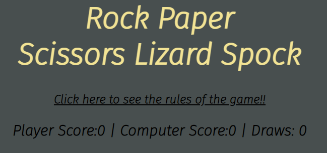
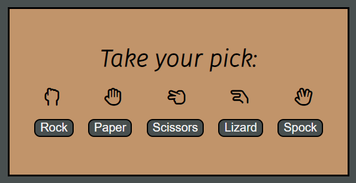
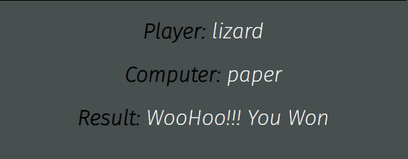

# Rock, Paper, Scissors, Lizard, Spock.
This is a game of chance. Its an updated more difficult version then the original game of Rock,Paper,Scissors. Used by many as a fair choosing method between two people, similar to flipping a coin. It can help settle a dispute or make a group decision. This updated version of the game was first made famous by the popular Tv sitcom - Big Bang Theory.
When you play this game you are playing against a computer. The computer chooses its play randomly which gives a fair result for the human player.Users of this game will learn the complex rules of Rock, Paper, Scissors, Lizard, Spock. This game was created with Adults and Children in mind.

# Features
## Existing features:
* Header
    * Placed at the top of the HTML body this header contains the name of the game. The header placement easily shows the user the name of the game.

* Link 
    * There is a link placed under the header that the user can click to view a complete list of rules for the game.
    
* Score Tracker
    * Under the link there is a score tracker to keep track of player wins, computer wins or draws. This allows users to keep a count of how they are doing against the computer.

* Game Options
    * Next we have the body of the game. There is 5 buttons the player can choose from. This are the games options, once selected the computer will then randomly generate a choice out of the 5 same options.
    

* Results
    * Under the body of the game there is the results window. Here the player can see the choice they have chosen and also the computer. Then it also shows the outcome of the game and it will tell the user if they have won or lost. The score tracker will then be updated with the result.
    

# Testing
* I tested the game in different browsers: Chrome, ios safari, and Firefox
* I confirmed that the results are always correct
* I confirmed the fonts and colors are easy to read by running it threw Lighthouse

# Bugs
* When creating the game none of my buttons would work, changing document.getElementById to querySelectorAll fixed the issue

# Unfixed bugs
* None

# Validator Testing
*   HTML
    * No errors where found when using the W3C validator
*   CSS
    * No errors where found when passing threw the official Jigsaw validator
*   JavaScript
    * No errors where found when passing threw the JS Hint validator

# Deployment:
* The site was deployed to GitHub Pages. The steps to deploy are:
    * In the GitHub repository, click onto the Settings tab
    * From the source section drop-down menu, select the Master Branch
    * Once the master branch has been selected, the page will be automatically refreshed with a detailed ribbon display to indicate the successful deployment.

The Live link to site is here -

# Credits 
* Code for my JavaScript button event listener and variables was taken from [github](https://github.com/kubowania/rock-paper-scissors-x3/blob/main/rock-paper-scissors-examples/rock-paper-scissors-example-1/app.js)
* My Icons where from [Font Awesome](https://fontawesome.com/)  
* The font families I used threw out the website I got from [Google Fonts](https://fonts.google.com/about)
